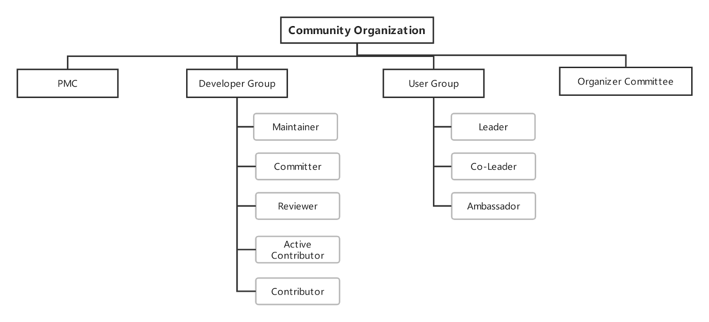

# 社区治理规范

## 行为准则

TiKV Community 遵循 [TiKV 行为准则](https://github.com/tikv/tikv/blob/master/CODE_OF_CONDUCT.md). 下面是部分摘录:

> In the interest of fostering an open and welcoming environment, we as contributors and maintainers pledge to making participation in our project and our community a harassment-free experience for everyone, regardless of age, body size, disability, ethnicity, sex characteristics, gender identity and expression, level of experience, education, socio-economic status, nationality, personal appearance, race, religion, or sexual identity and orientation.

## 社区角色

见 [社区角色](community-membership-zh_CN.md)

## 社区组织架构

社区架构分成两个部分，第一部分是社区角色架构图，第二部分为社区小组内部的角色分工，以及社区角色的晋升路径。

PMC：项目管理委员会，为项目核心管理团队，参与 roadmap 制定与社区相关的重大决议。

Developer Group：

* Maintainer：项目的规划和设计者，拥有合并主干分支的权限，从 Committer 中产生。
* Committer：由 maintainer 或 PMC 推荐，对 TiDB 有突出贡献的 contributor。需要独立完成至少一个 feature 或修复重大 bug。
* Reviewer：进阶 contributor，负责 review 社区代码，对代码有 LGTM 权限。可以参与到后续项目的设计中。
* Active Contributor：活跃的社区贡献者，有两位 reviewer 以上的社区角色提名通过。可以参与到 SIG 中。至少合并 8 个 pr 以上。
* Contributor：社区贡献者，在 TiDB 核心 repo 有一个以上被合并的 PR。

Organizer Committee：项目组织委员会，负责执行、输出，推广技术内容的组织者们，成员包括各地区用户组组长以及社区活动负责人。

## 开发者社区组织架构

社区对外的小组有 SIG 与 Working group（WG）。第二部分组织架构图对 SIG 和 WG 的定义、小组内部角色和个角色晋升通道进行了说明。

### 组织：

* SIG：专项兴趣小组，目前为邀请制。成员为在某一专项活跃的 contributor。小组最终目的为培养社区人才，帮助大家晋升为更高阶的 reviewer，committer 以及 maintainer。

* WG：开放的工作组，社区成员可以无门槛加入。工作组是为了完成一个短期项目而建立的临时小组，项目完成即解散。一个工作组可以横跨多个兴趣小组。经过一段时间的培训后优秀的社区小伙伴会被选入某个兴趣小组进行进一步深造。

### 内部角色：
* Tech Leader：小组技术负责人，对整个小组的技术走向进行把控。负责制定学习计划、成员考核制度等。一个小组可以有多个 Tech Leader。
* 其余角色见社区组织架构图

## 晋升通道：
1. Active Contributor -> Reviewer
2. Reviewer -> Committer
3. Committer -> Maintainer
